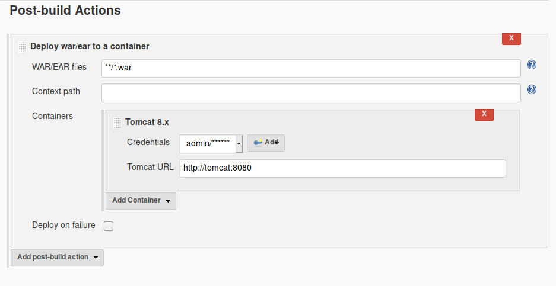
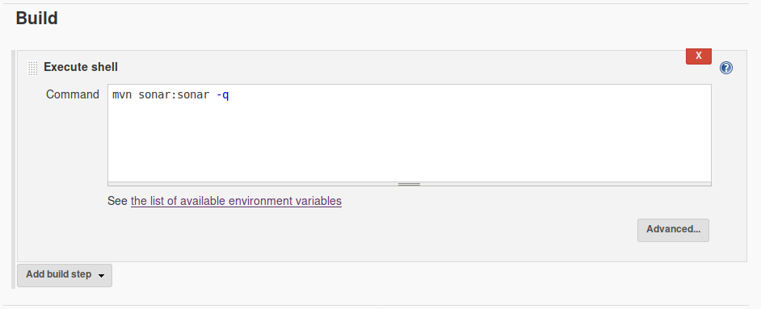

# Quality TP-2 Compte Rendu
By **SAMET MohamedAmin** and **DGHAIES Ahmed** GL4/2

## Description
This assignmint is a step-by-step description of a docker-compose application tailed with a demonstration of kubernetes. This application covers most of the tools described in the workshop.

## Environment
- linux os: Fedora 29
- Windows os: Windows 10
- Docker:
- Kubernetes:
- Jenkins:
- SonarQube:
- Jira:


## Content


## Tools description
### Docker
#### Setup
##### Linux
###### Installation
By default docker is provided within most of the official distrubtion repositories and it is designed to work perfectly inside a Unix-like envirnment. So in general no configuration is needed.  
- basic installation:
``` bash
[MohamedAmin@samet ]$ sudo dnf install docker -y
```

> In some cases when the official repositories does not offer the newest features that we want to use, following these installation instructions may be helpful https://docs.docker.com/install/linux/docker-ce/fedora

###### Run service
There are some different models to manage containers. Docker implements the `client/server` model. Docker is set of tools that manipulates docker containers. And in general docker is composed of docker client that communicates with the Docker daemon via a client/server operation. Then the Docker daemon creates the container and handles communications of stdin/stdout back to the Docker client tool.
Then when whenever we want to use docker, we have to run docker server

in fedora:
``` bash
[MohamedAmin@samet ]$ systemctl start docker
```

- To test it: `$ systemctl status docker`

##### Windows
---
---


### Sonarqube

### Jenkins


## App Process
Note that all the project we are going to use are of type `free style project`. It's quite possible to select the `maven project` type because al jobs we are going to create are maven based jobs.

### Structure
The app is composesd of:
- services:
  - jenkins_full:
    - configured jenkins image
    - port: `8080`
  - mongo:
    - database for spring-boot app
    - mongo data are stored in `./data/mongod`
  - sonarqube:
    - launch sonarqube
    - port: `9090`
  - sonar_db:
    - postgresql databse to store sonarqube data
    - uses `postgresql` and `postgresql_data`
  - tomcat:
    - developement tomcat serever
    - port: `8090`
  - tomcat_deploy:
    - deployment tomcat server
    - port: `8091`

- volumes:
  - sonarqube_conf:
    - stores sonarqube configuration
  - sonarqube_data: 
    - stores sonarqube data
  - sonarqube_extensions:
    - stores sonarqube extensions
  - postgresql:
    - stores postgresql
  - postgresql:
    - stores postgresql data

### Jenkins
#### Global tool configuration
- jdk


- git


- maven


#### Plugins
While building the developement environement, we are going to use these plugins. We'll explain the use of each later on.
- GitHub plugin
- Checkstyle Plug-in
- Pipeline
- Build Pipeline Plugin
- Copy Artifact Plugin
- Deploy to container Plugin

#### starting new project
- source code


- build triggers


### Checkstyle
- trigger checkstyle via maven


- activate checksyle plugin


### Tomcat
In this app we prepared two tomcat servers: One a developement server and the other as deployment server.

- Tomcat job configuration


### Sonarqube
Sonarqube configuaraions are described within spring-boot project properties
``` xml
  <properties>
    <!-- ... -->
    <sonar.host.url>${SONAR_HOST}:9000</sonar.host.url>
    <sonar.projectName>demo_app</sonar.projectName>
    <sonar.login>admin</sonar.login>
    <sonar.password>admin</sonar.password>
    <!-- ... -->
  </properties>
```

- To tigger build:



## Pipeline
This is the pipeline we are going to create:


Making a build based on pipeline have a lot of benifits:
- separation of concern. ie: focus on each job separaly of the others.
- If the build fails in a secondary step, the project won't broke-up.
- Adding a step or removing a step becomes really easy.
- Configuration becomes really fast and easy.

> in this example, we have encountered an error in `static-analysis` and `sonarqube` jobs and that didn't affect the deployment process at all


